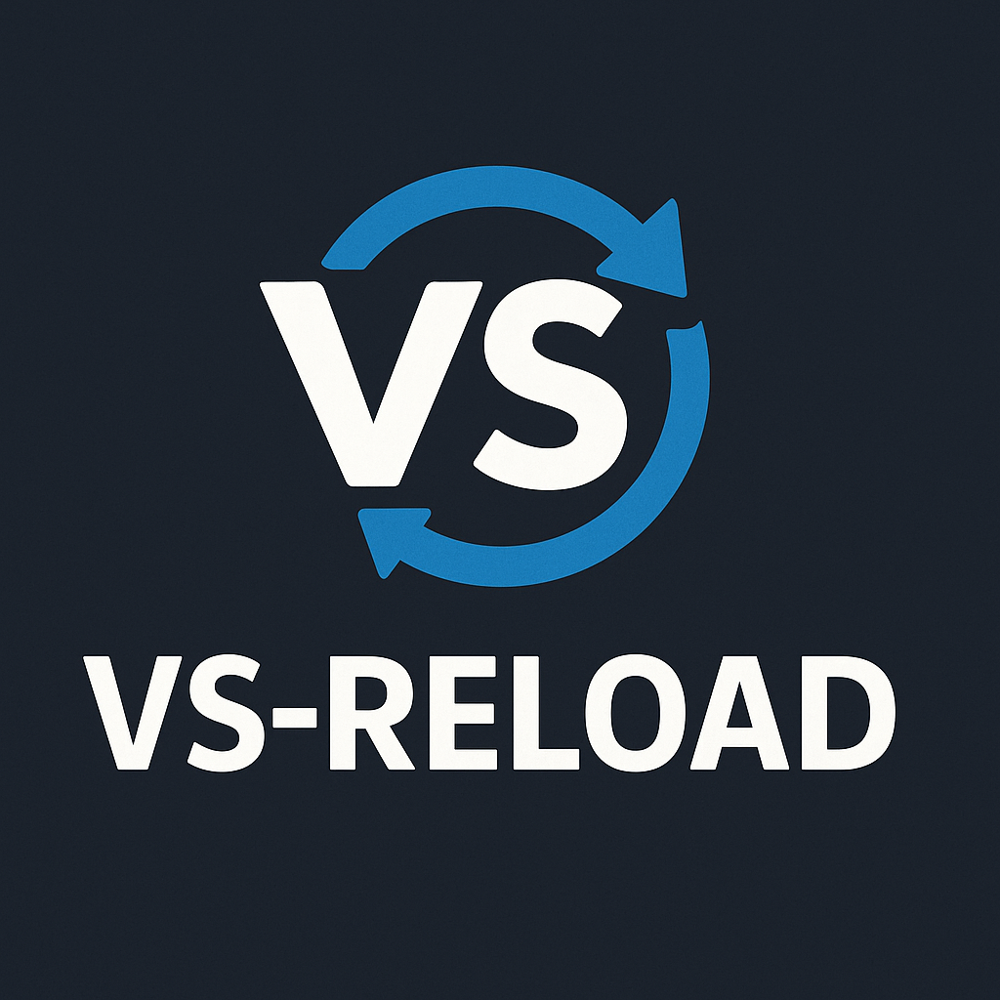

<div align="center">
  
  
# vs-reload

🚀 **Outil de développement pour extensions VS Code** avec rechargement automatique à chaud

  [](https://www.npmjs.com/package/vs-reload)
  [](https://opensource.org/licenses/MIT)
  [](https://github.com/hakan-karadag/vs-reload)
  [](https://code.visualstudio.com/)
  [](https://nodejs.org/)
  [](https://www.npmjs.com/package/vs-reload)

  > **Version Française (Current)** • [🇺🇸 **English Version**](README.md)
</div>

---

Compatible uniquement avec VS Code et les forks qui respectent strictement l'architecture native

## ✨ Fonctionnalités

- **🎯 VS Code natif** : Optimisé pour VS Code et les forks 100% compatibles
- **🚀 Lancement automatique** : Lance automatiquement VS Code avec l'extension chargée
- **⚡ Rechargement ultra-rapide** : Détection intelligente des changements avec synchronisation temporaire
- **📁 Chemins flexibles** : Utilisez `--project-path` et `--vscode-path` pour une flexibilité maximale
- **🖥️ Multi-plateforme** : Support natif pour Windows, macOS et Linux
- **🔧 Zéro configuration** : Fonctionne immédiatement dans n'importe quel répertoire d'extension

## 📦 Installation

```bash
npm install -g vs-reload
```

## 🚀 Démarrage rapide

### Utilisation basique (Auto-détection VS Code)
Naviguez vers le répertoire de votre extension VS Code et exécutez :

```bash
vs-reload
```
*Fonctionne automatiquement quand vous êtes dans un répertoire d'extension avec `package.json`*

### Utilisation avec chemin personnalisé

**Spécifier le chemin VS Code (quand VS Code n'est pas dans le PATH) :**
```bash
vs-reload --vscode-path="/path/to/Code.exe"
```

**Spécifier le chemin de l'extension (quand vous travaillez depuis l'extérieur du répertoire d'extension) :**
```bash
vs-reload --project-path="/path/to/extension"
```

**Les deux chemins (configuration complètement personnalisée) :**
```bash
vs-reload --project-path="/remote/extension" --vscode-path="/custom/vscode"
```

**Travailler sur n'importe quelle extension depuis n'importe où :**
```bash
vs-reload --project-path="/path/to/my-extension"
```

## 💻 Utilisation

### Options de ligne de commande

```bash
vs-reload [options]

Options:
  --project-path="/path/to/extension"   Utilise l'extension du chemin spécifié
  --vscode-path="/path/to/vscode"       Utilise l'exécutable VS Code spécifique
```

### Exemple de sortie
```bash
🚀 vs-reload - Outil de développement pour extensions VS Code

[10:30:15] 🎯 Chemin du projet : /dev/my-extension
[10:30:15] 🎯 Chemin VS Code : /Applications/Visual Studio Code.app/Contents/MacOS/Electron
[10:30:15] ✅ Extension détectée : My Awesome Extension
[10:30:15] ✅ Code.exe
[10:30:16] 🚀 Lancement...
[10:30:17] ✅ Lancé (12345)
[10:30:18] 🔧 My Awesome Extension chargée
[10:30:18] 👀 Surveillance...

✅ Mode développement activé !
ℹ️ Appuyez sur Ctrl+C pour arrêter

[10:31:23] 📝 extension.js
[10:31:23] 🔄 Synchronisé : extension.js
[10:31:23] 🔄 Rechargé
```

## 🎯 Compatibilité

vs-reload est conçu spécifiquement pour **VS Code** et fonctionne avec :

| Éditor | Compatibilité | Statut |
|--------|---------------|---------|
| **VS Code** | ✅ Support complet | **Recommandé** |
| **VS Code Insiders** | ✅ Support complet | **Testé** |
| **Versions portables VS Code** | ✅ Support complet | **Compatible** |
| **Forks tiers** | ⚠️ Dépend de la compatibilité | **Non garanti** |

### ⚠️ Exigences strictes de compatibilité

Pour qu'un éditeur fonctionne avec vs-reload, il **DOIT** :
- **Supporter** l'argument `--extensionDevelopmentPath` nativement
- **Implémenter** la commande API `workbench.action.reloadWindow`
- **Respecter** l'architecture VS Code pour le développement d'extensions
- **Maintenir** la compatibilité avec le cycle de vie des extensions VS Code

### 🚫 Forks non compatibles

De nombreux éditeurs basés sur VS Code ne supportent **PAS** complètement le développement d'extensions et causeront des dysfonctionnements ou plantages.

## 🔧 Comment ça fonctionne

vs-reload utilise un système d'injection temporaire sophistiqué avec signaux de reload basés sur JSON :

### Système de rechargement intelligent
- **Fichier signal JSON** : Utilise `reload.json` avec métadonnées (timestamp, raison, info outil)
- **Surveillance intelligente** : L'extension helper surveille la création de `reload.json`
- **Reload fiable** : Utilise la commande native VS Code `workbench.action.reloadWindow`
- **Multi-plateforme** : Aucune automatisation clavier fragile (Ctrl+R, SendKeys, xdotool)
- **Logs détaillés** : Affiche la raison du reload et timestamp dans la console VS Code

### Système d'injection temporaire
- **Copie temporaire** : Création d'une copie complète de l'extension dans `/tmp/`
- **Injection propre** : Code de rechargement injecté uniquement dans la copie temporaire
- **Synchronisation automatique** : Mise à jour en temps réel des fichiers modifiés
- **Aucune pollution** : Les fichiers source originaux ne sont jamais touchés

### Détection intelligente de VS Code
- **Auto-détection** : Trouve VS Code dans le PATH et répertoires d'installation communs
- **Chemins personnalisés** : Utilisez `--vscode-path` pour spécifier une installation VS Code
- **Validation stricte** : Vérifie la compatibilité avant le lancement

### Gestion flexible de projets
- **Auto-détection** : Fonctionne dans le répertoire courant par défaut
- **Chemins personnalisés** : Utilisez `--project-path` pour spécifier l'emplacement de l'extension
- **Développement distant** : Parfait pour Docker, WSL, ou systèmes de fichiers distants

## ⚙️ Configuration

vs-reload fonctionne avec des paramètres par défaut sensés. La configuration peut être modifiée dans le code source :

```javascript
const CONFIG = {
  debounceMs: 150,          // Temps d'anti-rebond pour changement de fichier
  launchDelay: 300,         // Temps de stabilisation VS Code
  watchPatterns: [          // Motifs de fichiers surveillés
    '**/*.js', '**/*.ts', '**/*.jsx', '**/*.tsx', '**/*.json'
  ],
  ignorePatterns: [         // Répertoires ignorés
    '**/node_modules/**', '**/.git/**', '**/out/**', '**/reload.json'
  ]
};
```

## 🧪 Tests

Testez vs-reload avec l'extension d'exemple incluse :

```bash
git clone https://github.com/hakan-karadag/vs-reload.git
cd vs-reload
npm install
npm test
```

## 🌐 Compatibilité des plateformes

| Plateforme | Auto-détection | Chemins personnalisés | Statut |
|----------|---------------|---------------------|---------|
| **Windows 10/11** | ✅ PATH + Registre + Program Files | ✅ Support complet | **Entièrement testé** |
| **macOS** | ✅ PATH + Dossier Applications | ✅ Support complet | **Compatible** |  
| **Linux** | ✅ PATH + gestionnaires de paquets | ✅ Support complet | **Compatible** |

## 🛠️ Dépannage

### Problèmes courants

**vs-reload ne trouve pas VS Code**
```bash
# Utilisez un chemin personnalisé vers VS Code
vs-reload --vscode-path="/path/to/Code.exe"

# Ou assurez-vous que VS Code est dans le PATH
code --version
```

**Extension pas dans le répertoire courant**
```bash
# Spécifiez le chemin de l'extension
vs-reload --project-path="/path/to/extension"
```

**L'éditeur se ferme immédiatement**
```bash
# Cela indique un éditeur non compatible avec le développement d'extensions VS Code
# Utilisez VS Code officiel :
vs-reload --vscode-path="/path/to/official/Code.exe"
```

## 📊 Performance

- **🚀 Temps de lancement** : ~300ms
- **⚡ Vitesse de rechargement** : ~150ms  
- **💾 Utilisation mémoire** : <30MB
- **📁 Surveillance fichiers** : Événements OS natifs
- **🔄 Impact CPU** : Minimal (<1%)
- **🎯 Signal JSON** : Système de reload ultra-fiable et multi-plateforme

## 🤝 Contribution

Les contributions sont les bienvenues ! vs-reload a une architecture propre et modulaire :

```
src/
├── cli.js              # Point d'entrée principal & analyse des arguments
├── utils.js            # Configuration & utilitaires partagés  
├── extension-detector.js # Validation d'extension avec chemins personnalisés
├── vscode-manager.js   # Découverte VS Code & résolution de chemin
├── extension-manager.js # Cycle de vie processus & injection temporaire
├── file-watcher.js     # Surveillance intelligente de fichiers avec sync
└── example/            # Extension de test pour développement
```

### Configuration de développement
```bash
git clone https://github.com/hakan-karadag/vs-reload.git
cd vs-reload
npm install
npm link
```

## 📄 Licence

**Licence MIT** - voir [LICENSE](LICENSE) pour les détails

## 🙏 Remerciements

- Construit pour la communauté de développement d'extensions VS Code
- Inspiré par le besoin de workflows de développement plus rapides
- Testé avec des extensions VS Code du monde réel

---
<div align="center">
  
**⭐ VS-Reload vous a fait gagner du temps dans le développement d'extensions ? N'hésitez pas à étoiler le projet !**

Développé avec ❤️ par [@hakan-karadag](https://github.com/hakan-karadag)

[⭐ Étoiler](https://github.com/hakan-karadag/vs-reload) • [🐛 Signaler un bug](https://github.com/hakan-karadag/vs-reload/issues) • [💡 Demander une fonctionnalité](https://github.com/hakan-karadag/vs-reload/issues) • [📚 Documentation](https://github.com/hakan-karadag/vs-reload#readme)

</div>